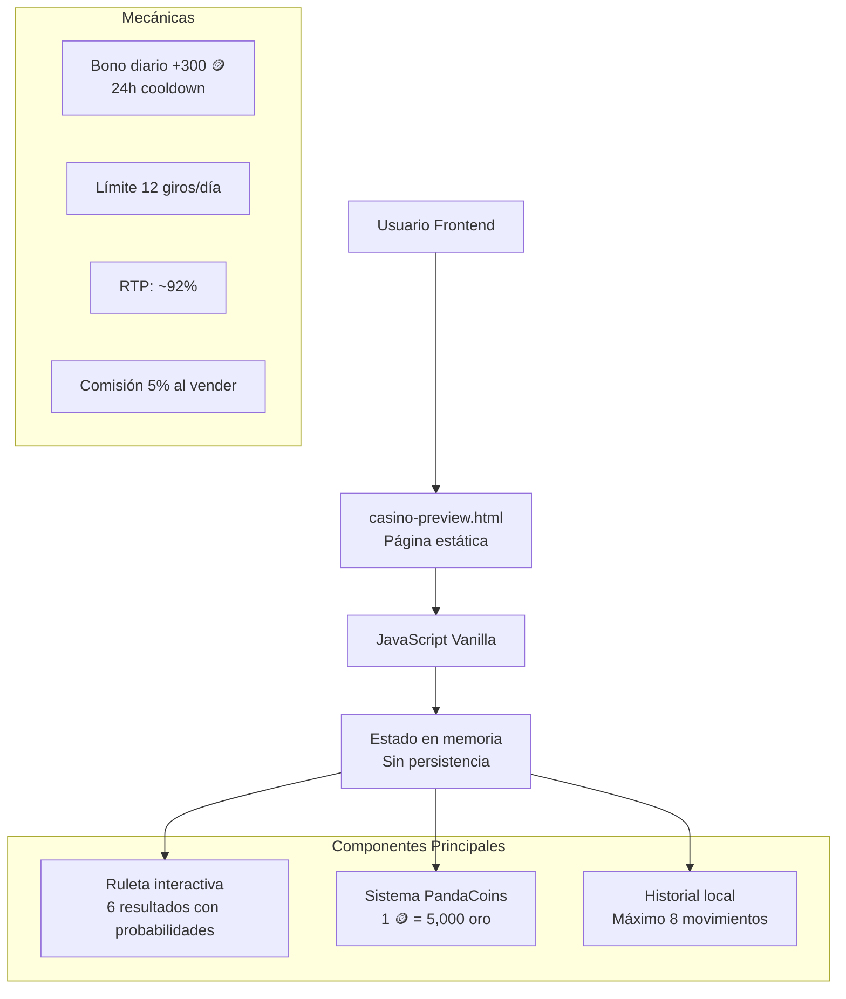
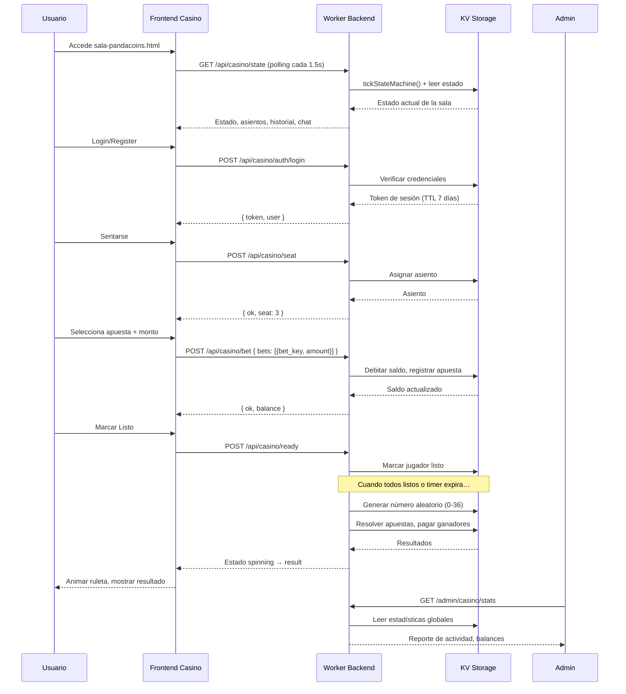
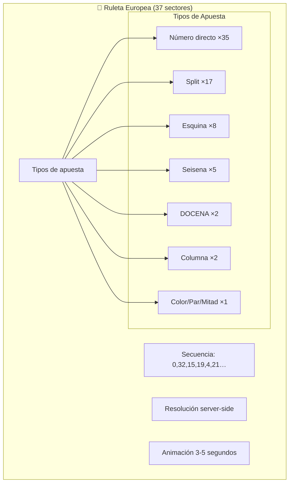
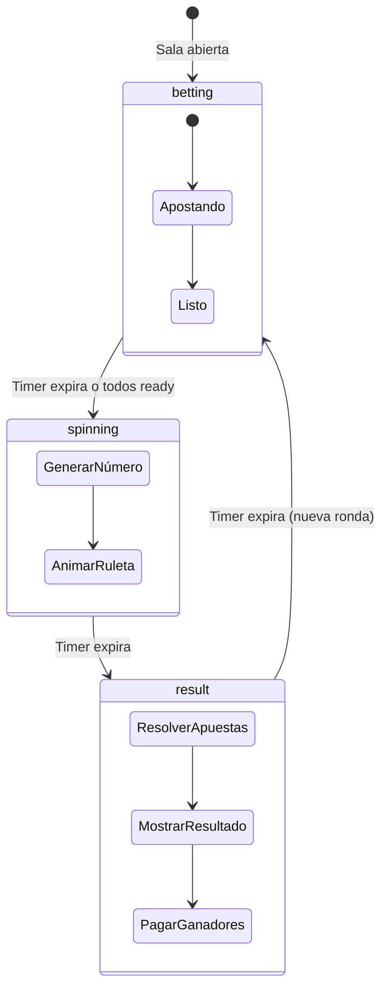
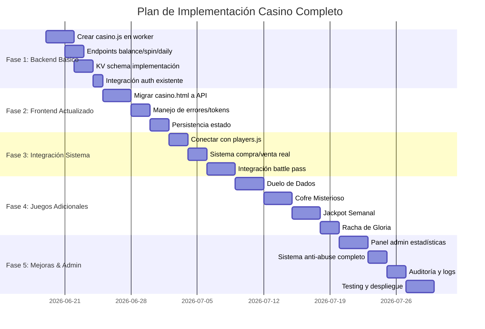

# Diagrama del Ecosistema de Casino Exilium

## 1. Arquitectura Actual (Frontend-Only)



## 2. Arquitectura Actual (Backend + Frontend)

```mermaid
flowchart TD
    A[Usuario Frontend] --> B[sala-pandacoins-standalone.html<br>SPA Vanilla JS]
    B --> C[API Requests]
    C --> D[Cloudflare Worker<br>worker/casino.js]
    
    D --> E[Autenticación<br>Token sesión KV]
    D --> F[Máquina de estados<br>Anti-abuse checks]
    D --> G[Persistencia de datos]
    
    G --> H[EXILIUM_KV Namespace]
    
    subgraph "KV Keys Schema"
        H1[casino:state]
        H2[casino:seats]
        H3[casino:chat]
        H4[casino:rounds_history]
        H5[casino:config]
        H6[casino:user:{id}]
        H7[casino:transactions:{id}]
    end
    
    subgraph "Endpoints REST API"
        I1[GET /api/casino/state]
        I2[POST /api/casino/seat]
        I3[POST /api/casino/bet]
        I4[POST /api/casino/clear-bets]
        I5[POST /api/casino/ready]
        I6[POST /api/casino/chat]
        I7[GET /api/casino/leaderboard]
        I8[GET /api/casino/me]
        I9[GET /api/casino/players]
    end
    
    J[Servidor] --> K[🎰 Ruleta Europea<br>37 sectores]
    
    U[Admin Panel] --> V[Auditoría transacciones]
    U --> W[Configuración sala]
    U --> X[Estadísticas avanzadas]
    U --> Y[Gestión usuarios]
```

## 3. Flujo de Datos



## 4. Sistema de Juegos



## 5. Flujo de Sala Multijugador



## 6. Características Implementadas

```yaml
caracteristicas:
  - ruleta_europea_multijugador: true
  - persistencia_kv: true
  - autenticacion_con_token: true
  - login_discord_oauth: true
  - polling_tiempo_real: true
  - animacion_ruleta_svg: true
  - panel_admin_completo: true
  - historial_rondas: true
  - estadisticas_avanzadas: true
  - sistema_asientos: true
  - chat_en_vivo: true
  - leaderboard: true
  - rate_limiting: true
  - auditoria_transacciones: true
```

### Estado Propuesto (Completo)
```yaml
caracteristicas:
  - ruleta_funcional: true
  - sistema_moneda: true
  - bono_diario: true
  - historial: true
  - persistencia: true
  - autenticacion: true
  - integracion_battlepass: true
  - backend_api: true
  - anti_abuse_measures: true
  - juegos_adicionales: 4+
  - estadisticas: true
  - admin_panel: true
  - auditoria: true
  - sistema_rangos: true
  - jackpot_semanal: true
```

## 8. Plan de Implementación



## 9. Resumen Técnico

### Tecnologías Utilizadas:
- **Frontend**: HTML5, CSS3, JavaScript Vanilla (actual), posible migración a React
- **Backend**: Cloudflare Workers (JavaScript)
- **Base de datos**: Cloudflare KV (key-value store)
- **Almacenamiento**: Cloudflare R2 para assets multimedia
- **Autenticación**: Sistema JWT existente en auth.js
- **Despliegue**: Cloudflare Pages + Workers

### Estructura de Archivos:
```
exilium-web-v2/
├── deploy/
│   ├── casino-preview.html      # Preview actual
│   ├── casino.html              # Futura implementación completa
│   └── CASINO_CONTEXT.txt       # Documentación contexto
├── worker/
│   ├── index.js                 # Router principal
│   ├── casino.js                # Futuro módulo casino
│   ├── players.js               # Sistema jugadores (existente)
│   └── auth.js                  # Autenticación (existente)
└── wrangler.toml                # Config KV bindings
```

### Variables de Entorno KV:
```javascript
// Keys propuestas para casino
casino:balance:{playerId}        // Saldo actual PandaCoins
casino:history:{playerId}        // Array de transacciones
casino:daily:{playerId}          // Timestamp último bono
casino:spins:{playerId}:{date}   // Contador giros diarios
casino:jackpot_pool              // Pool jackpot semanal
casino:stats:{playerId}          // Estadísticas jugador
casino:transactions:{playerId}   // Log detallado transacciones
casino:config:probabilities      // Probabilidades configurables
casino:config:limits             // Límites configurables
```

### Endpoints REST Propuestos:
```http
# Públicos (requieren auth)
GET    /api/casino/balance      # Obtener saldo
POST   /api/casino/spin         # Girar ruleta
POST   /api/casino/daily        # Reclamar bono
POST   /api/casino/buy          # Comprar PandaCoins
POST   /api/casino/sell         # Vender PandaCoins
GET    /api/casino/history      # Historial movimientos
GET    /api/casino/jackpot      # Estado jackpot
GET    /api/casino/stats        # Estadísticas jugador
GET    /api/casino/leaderboard  # Top jugadores

# Admin (requieren admin auth)
GET    /api/admin/casino/stats  # Estadísticas globales
GET    /api/admin/casino/audit  # Auditoría transacciones
PUT    /api/admin/casino/config # Configurar probabilidades
POST   /api/admin/casino/reset  # Resetear datos (emergencia)
```

## Conclusión

El ecosistema de casino de Exilium tiene una base sólida con el preview frontend actual, pero necesita:
1. **Backend persistente** en Cloudflare Workers + KV
2. **Integración real** con el sistema de jugadores existente
3. **Mecánicas anti-abuse** del lado servidor
4. **Juegos adicionales** para variedad
5. **Panel de administración** para monitoreo

La implementación propuesta mantiene la arquitectura existente de Exilium (Workers + KV) mientras añade un sistema de casino completo, integrado y seguro.